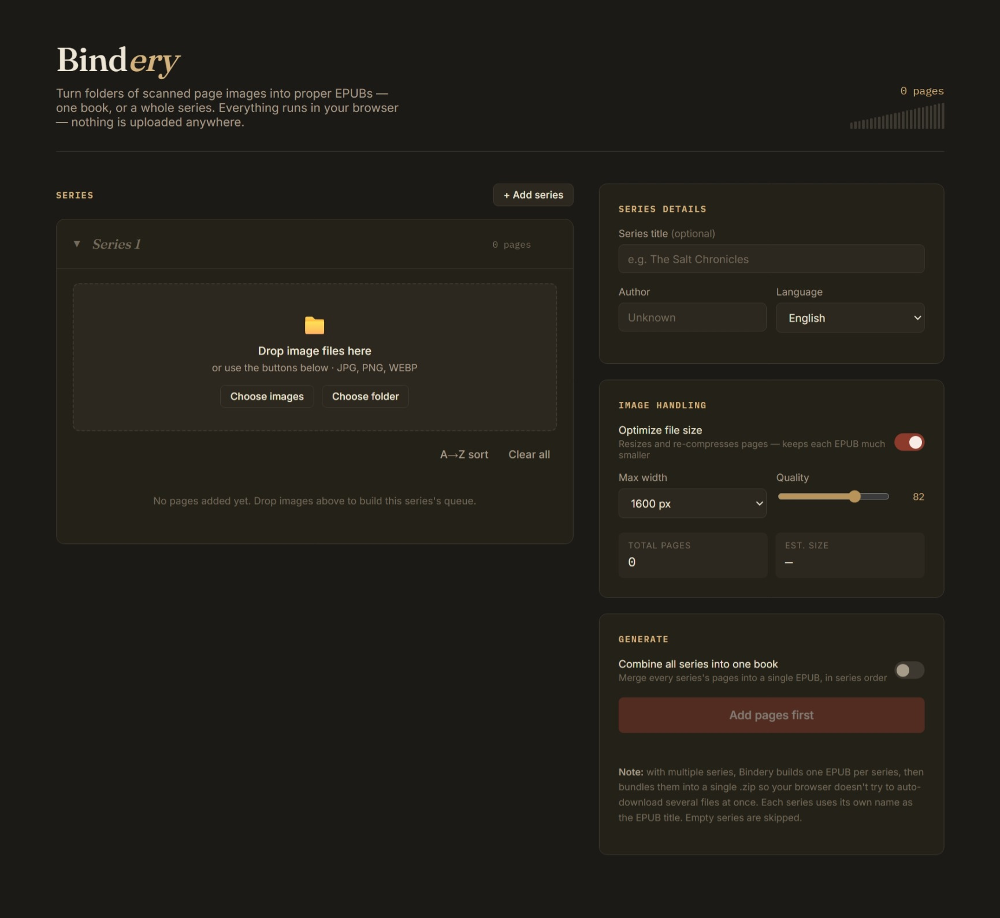

# Bindery

A single-file browser tool that turns scanned page images (JPG, PNG, WEBP) into a proper EPUB — one book, or a multi-series collection. No install, no accounts, No pop-ups with ads or viruses: everything runs client-side in your browser.

單文件瀏覽器工具，可將掃描的頁面影像（JPG、PNG、WEBP）轉換為標準的 EPUB 檔案－無論是單冊書籍或多卷系列。無需安裝，不用註冊帳號，沒有廣告或是帶有病毒的彈出視窗：所有操作都在您的瀏覽器中用戶端運行。

## Why

Ebooks sourced from scans or downloads sometimes turn out to be a folder of page images instead of a real EPUB. Bindery packages those images into a standards-compliant EPUB3 file that opens correctly in Calibre, Apple Books, Kindle (via conversion), and most other readers.

從掃描或下載獲得的電子書有時會變成一個包含頁面圖像的資料夾，而不是真正的 EPUB 檔案。 Bindery 會將這些圖像打包成符合標準的 EPUB3 文件，該文件可在 Calibre、Apple Books、Kindle（透過轉換）以及大多數其他閱讀器中正確開啟。

## Usage

1. Download [`bindery.html`](./bindery.html) (or open it via [GitHub Pages](#hosting), if enabled on this repo).下載 [`bindery.html`](./bindery.html)（如果此倉庫啟用了 [GitHub Pages](#hosting)，則可透過 GitHub Pages 開啟）。
2. Open it in any modern browser — Chrome, Edge, Firefox, or Safari.在任何瀏覽器中開啟它—Chrome、Edge、Firefox 或 Safari。
3. Drag your page images into a series, or use "Choose images" / "Choose folder".將頁面圖像拖入系列中，或使用「選擇圖像」/「選擇資料夾」選項。
4. Fill in the book/series details and hit **Generate EPUB**.填寫書籍/系列詳情，然後點選「生成 EPUB」。

## Features

- **Multi-series support** — add as many series as you need (`+ Add series`), each with its own drop zone and page queue, collapsible so long collections stay manageable.
- **Duplicate filename handling** — if a new file's name already exists in a series, you're prompted to Replace, Skip, or Rename, with an "apply to all remaining" option for large batches.
- **Combine into one book** — merge every series into a single EPUB (each series becomes a chapter entry in the table of contents), or keep series as separate files named `SeriesTitle-1`, `SeriesTitle-2`, etc.
- **Size optimization** — optional client-side resize/recompress (adjustable max width and JPEG quality) before packing, since raw scans can otherwise produce multi-gigabyte EPUBs.

- **多系列支援** — 根據需要新增任意數量的系列（點擊「+ 新增系列」），每個系列都有獨立的拖放區域和頁面佇列，可以摺疊，方便管理多個系列。
- **重複檔案名稱處理** — 如果新檔案名稱已存在於某個系列中，系統會提示您選擇“取代”、“跳過”或“重新命名”，對於大量文件，也可以選擇“套用於所有剩餘檔案”。
- **合併成一本書** — 將所有捲合併成一個 EPUB 文件（每個卷都會成為目錄中的一個章節條目），或者將卷保留為單獨的文件，分別命名為 `SeriesTitle-1`、`SeriesTitle-2` 等。
- **檔案大小最佳化** — 打包前可選擇在客戶端調整大小/重新壓縮（可調整最大寬度和 JPEG 品質），因為原始掃描件可能會產生數 GB 的 EPUB 檔案。

## Privacy

Nothing leaves your machine. Image processing, EPUB packaging, and zipping all happen in-browser via [JSZip](https://stuk.github.io/jszip/) loaded from a CDN — there's no backend and no file upload involved.

所有數據都不會離開您的裝置。映像處理、EPUB 打包和壓縮都在瀏覽器內透過從 CDN 載入的 [JSZip](https://stuk.github.io/jszip/) 完成 — 無需後端伺服器，也無需上傳檔案。

## Limitations

- Large batches (1000+ pages) can take a few minutes to process and use noticeable browser memory. Keep the tab active while it runs, and lower the max-width setting if the browser struggles.
- Output is image-based (like a scanned/comic-style EPUB) — there's no OCR or text layer, so reflowable-text features (font resizing, text-to-speech) won't apply to the page content itself.
- Tested in current Chrome, Edge, and Firefox. Very old browsers may lack support for some APIs used (`webkitdirectory`, `canvas.toBlob`, etc.).

- 處理大量文件（1000 頁以上）可能需要幾分鐘時間，並且會佔用較多的瀏覽器記憶體。請在處理過程中保持標籤頁處於活動狀態，如果瀏覽器運作緩慢，請降低最大寬度設定。
- 輸出為圖像格式（類似於掃描/漫畫風格的 EPUB），沒有 OCR 或文字圖層，因此可重排文字功能（字體大小調整、文字轉語音）不會應用於頁面內容本身。
- 已在最新版本的 Chrome、Edge 和 Firefox 中測試。非常舊的瀏覽器可能不支援某些 API（例如 `webkitdirectory`、`canvas.toBlob` 等）。

## License

MIT — do whatever you'd like with it.

MIT 授權協議—您可以隨意使用它。
